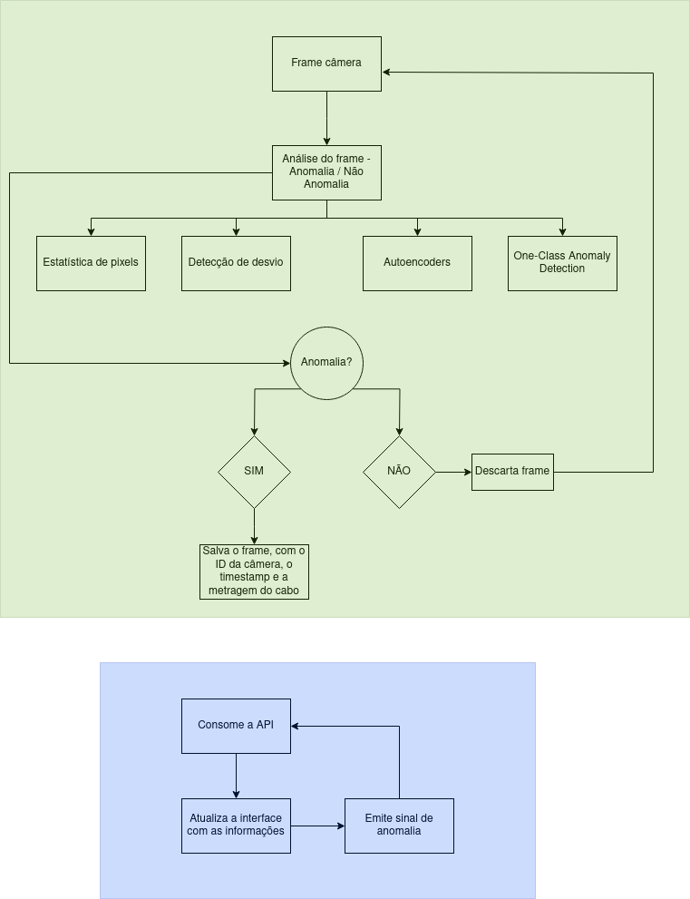

# MPTCable Fault Detection

  

The goal of this project is to improve the quality of optical network products manufactured by MPT Cables with an innovative inspection system that uses computer vision and artificial intelligence to detect defects in the outer insulation of optical cables.

## Primeiros passos

..

### Prerequisitos

Para o bom funcionamento, é ideal que os requsitos abaixo sejam atendidos:

...

---
**Atenção!**
**Recomendamos que utilize o container Docker desenvolvido para este projeto, pois a aplicação é estável. Evitando assim, o risco de instalações erradas, erros de paths e versões de bibliotecas.**

---

### Instalação 

Localmente:
...

Docker:
...

## Utilização

Localmente:
...

Docker:
...

---

## Demonstração

...
---

## 🤝 Collaborators

Agradecemos às seguintes pessoas que contribuíram para este projeto:

<table>
  <tr>
    <td align="center">
      <a href="#">
         
        
          <b>Natanael Vitorino</b>
        
      </a>
    </td>
    <td align="center">
      <a href="#">
         
        
          <b>Eduardo Weber</b>
        
      </a>
    </td>
  </tr>
</table>

## 📝 License

This project is under license. See the file [LICENSE](LICENSE) for more details.

---