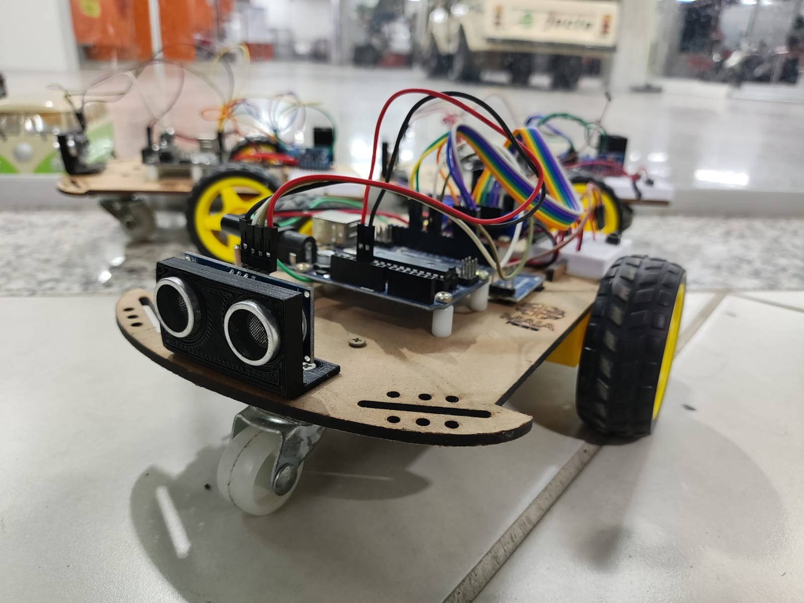

# Maia Junior Robot
<p align="center">
  
</p>

Este projeto visa introduzir lógica de programação nível iniciane. 
## Primeiros passos
Tenha em mãos um Maia Jr
..

### Prerequisitos

Para o bom funcionamento, é ideal que os requesitos abaixo sejam atendidos:
- Platform IO
- Ter o o Maia Jr em mãos


---

### Instalação 

Localmente:
```
git clone https://github.com/nata-vito/maia_robotJr.git
```

[![Assista o vídeo, abra este projeto dentro do Platform IO e execute-o]](https://www.youtube.com/watch?v=08N86hk8ZaY)

Faça as conexões como a tabela abaixo de Pinout:

| Arduino | Maia Jr     |
|---------|-------------|
| 9       | TRIGGER_PIN (Ultrasônico)|
| 10      | ECHO_PIN (Ultrasônico)|
| 6       | ENA (Ponte H)|
| 13      | IN1 (Ponte H)|
| 12      | IN2 (Ponte H)|
| 5       | ENB (Ponte H)|
| 4       | IN3 (Ponte H)|
| 3       | IN4 (Ponte H|


## Utilização

Localmente:

1º - Conecte a placa arduino ao seu computador

2º - Copile o programa utilizando o Platform IO

3º - Desconecte o arduino do seu PC e ligue o robô

Se tudo estiver dado certo, o robô ativará as suas rodas e o seu funcionamento estará correto.


## 🤝 Collaborators

Agradecemos às seguintes pessoas que contribuíram para este projeto:

<table>
  <tr>
    <td align="center">
      <a href="#">
        <br>
        <sub>
          <b>Natanael Vitorino</b>
        </sub>
      </a>
    </td>
  </tr>
</table>

## 📝 License

This project is under license. See the file [LICENSE](LICENSE) for more details.

---